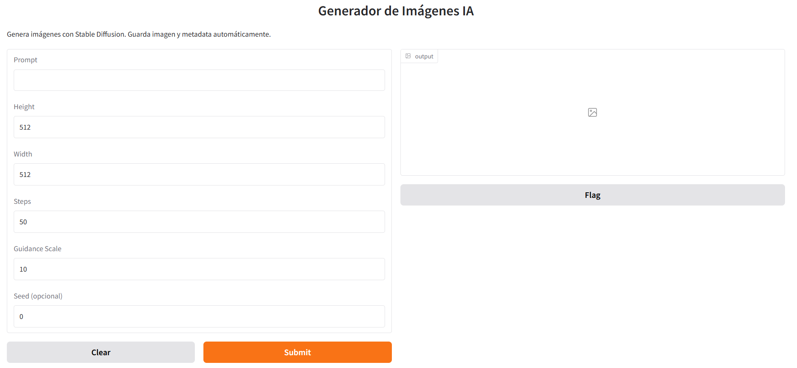
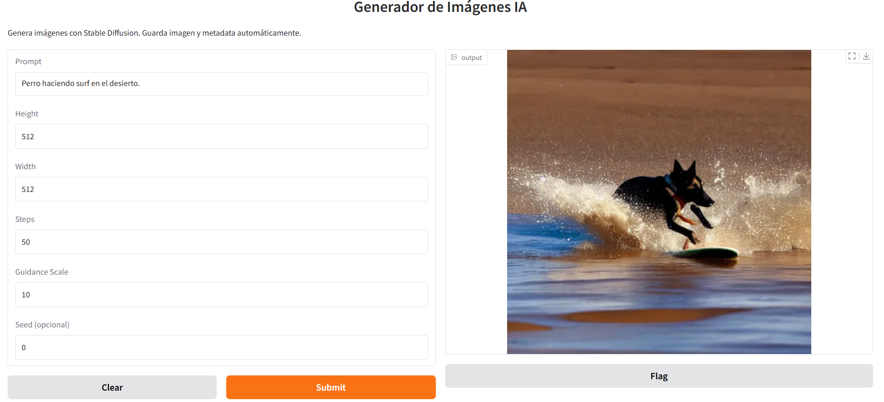
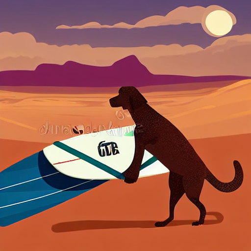

# 🎨 Generador de Imágenes con Hugging Face Diffusers
En este proyecto se ha implementado una aplicación de generación de imágenes a partir de texto (text-to-image) usando modelos preentrenados de **Stable Diffusion** y la librería **Hugging Face Diffusers**, con una interfaz gráfica creada en Gradio.

Incluye todo el flujo: desde la configuración del entorno y carga del modelo hasta la inferencia y visualización de imágenes generadas.

---


# 🚀 Uso

### Paso 1. Ejecución del generador:

```bash
python src/main.py
```

Se pondrá en marcha un servidor web Gradio, por defecto en el puerto 7860.



**Flujo:**

* Escribir una descripción (prompt) en la caja de texto de la interfaz.

* Pulsar "Generar".

* Esperar unos segundos mientras el modelo procesa la entrada.

* Visualizar y descargar la imagen generada.



---

# 🖼️ Imágenes generadas

Prompt: "Persona haciendo surf en el desierto."


Prompt: "Perro haciendo surf en el desierto."



Prompt: "Perro haciendo surf en el desierto."


El modelo genera imágenes muy ajustadas al prompt introducido y, al mismo tiempo, puede producir resultados distintos con el mismo prompt, mostrando su variabilidad creativa.

# ✨ Características principales

Uso de Stable Diffusion preentrenado para generación de imágenes de alta calidad.

Interfaz gráfica simple y amigable con Gradio.

Posibilidad de ajustar el guidance scale y la resolución para personalizar resultados.

Código modular y fácilmente ampliable para añadir filtros o procesamientos extra.

Uso directo de modelos preentrenados sin necesidad de entrenamiento desde cero.

---


# 📁 Estructura del proyecto

La carpeta principal incluye todo lo necesario para reproducir el generador:

src/main.py         → Script principal que lanza la interfaz y ejecuta la inferencia.

data/               → Carpeta opcional para guardar imágenes generadas.

requirements.txt    → Lista de dependencias necesarias.

media/              → Recursos multimedia para documentación (gifs, capturas).

---


# 🛠️ Instalación

### Requisitos previos

Python 3.10 instalado

### Crear entorno virtual

```bash
python -m venv venv

source venv/bin/activate   # En Linux/Mac

venv\Scripts\activate      # En Windows
```

### Instalar dependencias

```bash
pip install -r requirements.txt
```

---

# 🔍 Tecnologías y habilidades

**Lenguajes:** Python  

**Frameworks/Librerías:** Hugging Face Diffusers, Gradio, FastAPI  

**Herramientas:** Git, entornos virtuales, pip  

**Áreas de IA:** Text-to-Image, modelos generativos, optimización de inferencia

---


# 📌 Notas

La primera ejecución descargará el modelo desde Hugging Face, por lo que puede tardar varios minutos.

La calidad y coherencia de las imágenes dependen en gran parte de la calidad y detalle del prompt.

Si usas GPU, la generación será mucho más rápida.

El proyecto no incluye imágenes generadas por defecto; se pueden guardar en la carpeta data/.

---


# 📜 Licencia

Uso educativo y de demostración. El modelo Stable Diffusion tiene su propia licencia y restricciones de uso, revisa los términos en Hugging Face.